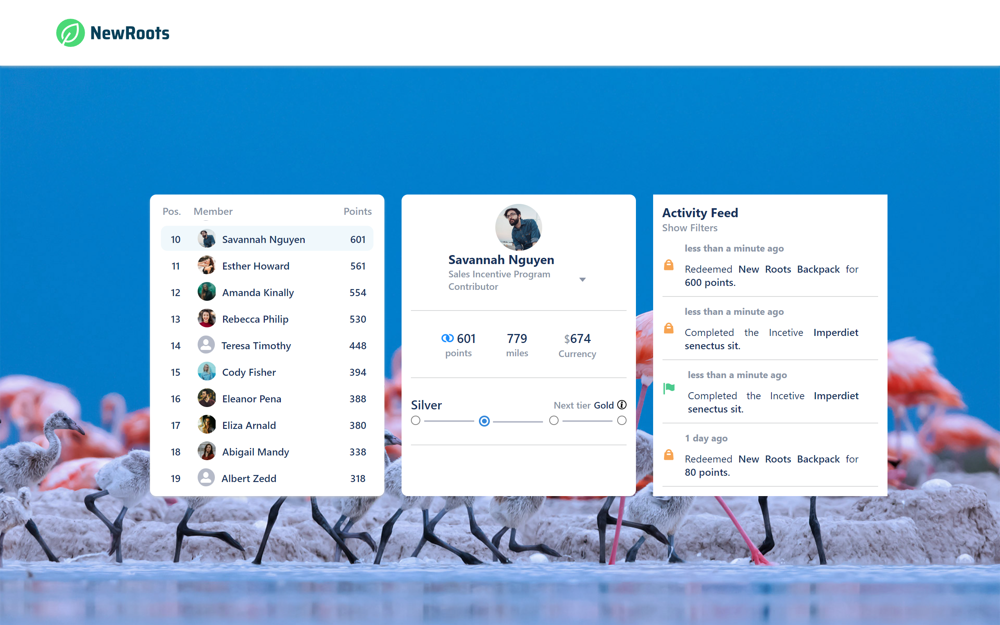

# Welcome! 👋

This is a solution to the challenge [Fielo](https://github.com/MarcoFranca/eureka-challenge).

A responsive design of a leder board with details of the user and their activities.

---

- [Overview](#overview)
  - [The challenge](#the-challenge)
  - [Links](#links)
- [My process](#my-process)
  - [Built with](#built-with)
  - [How it works](#how-it-works)
- [Author](#author)

# Overview
## The challenge

- the design should be as close as possible to the prototype
  **- [Link](https://www.figma.com/proto/23JH8HYpZv232BDAB3UC57/Test?node-id=14%3A4878&scaling=min-zoom&page-id=0%3A1&starting-point-node-id=14%3A4707)**
- The URL of the background image must be extracted from the [API do Bing](https://www.bing.com/HPImageArchive.aspx?format=js&idx=0&n=1&mkt=pt-BR).
  - __** IMPORTANT The Bing API has Cors Blocking, to be able to use the background images it will be necessary to install a Cors Unblocking Extension, since I don't have access to the API header__
    [Link da extenção](https://chrome.google.com/webstore/detail/cors-unblock/lfhmikememgdcahcdlaciloancbhjino?hl=pt)
- Users and their information must be taken from the Fielo API



## links

- [live site URL](https://eureka-challenge.vercel.app/)

# My process

## Built With

- Semantic HTML5 markup
- CSS Modules
- Flexbox
- grid
- mobile-first
- React
- React-router
- Contex api

## How it works

**two functions were made to access the Fielo API:**

- Function to get the token:

```javascript
export const  getFielo = (token, route, setState) => {
    axios.get((fielo.url + route), {
        headers: {
            'x-access-token': token
        }})
        .then(response => {
            setState(response.data)
        })
        .catch(error => console.log(error))
}

```
- Get function to capture information:

```javascript
export const  getFielo = (token, route, setState) => {
    axios.get((fielo.url + route), {
        headers: {
            'x-access-token': token
        }})
        .then(response => {
            setState(response.data)
        })
        .catch(error => console.log(error))
}
```

---

All api settings are stored in the `apiConfig.js` file.

`Contex api` was used to concentrate the information obtained from the API in the `UsersContext.js` file.

The entire application is started from the `Home` page where it has the `provider` of the context

The code was divided into components with the idea of being able to reuse the same

In the `assets` folder in `global`, there is a file with the functions used and another with the default colors. 


---

## Author
- Linkdin - [Marco Tullio Franca](https://www.linkedin.com/in/marco-franca/)
- Frontend Mentor - [@MarcoFranca](https://www.frontendmentor.io/profile/MarcoFranca)
